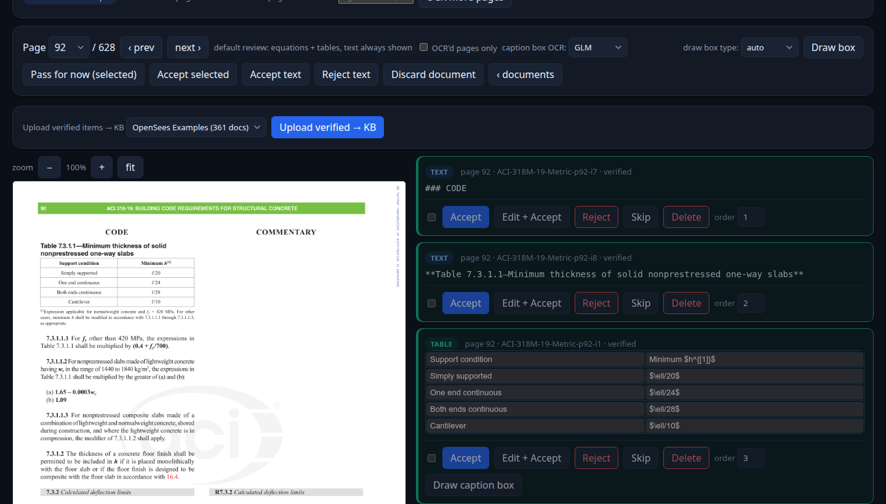
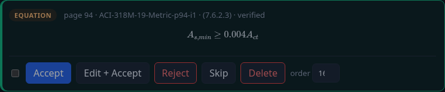
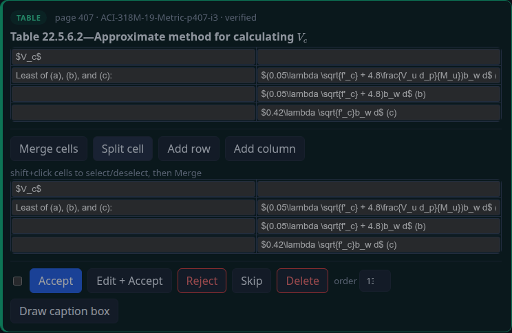
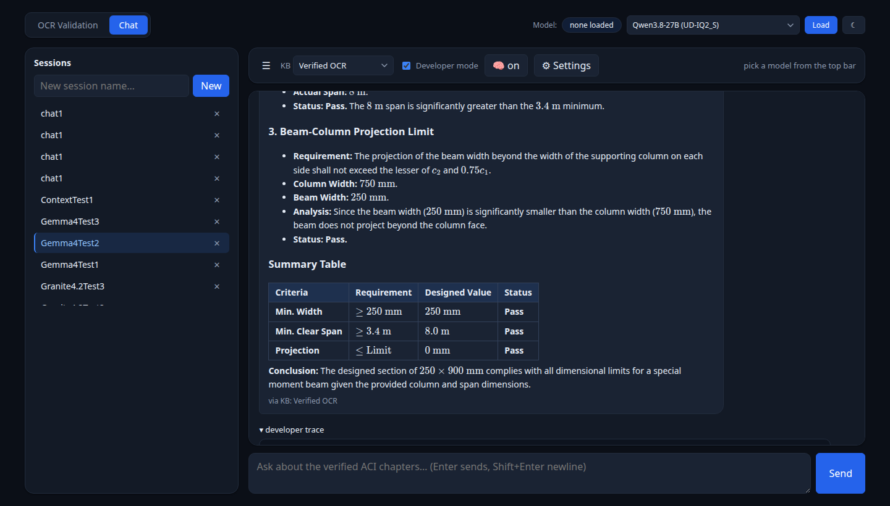
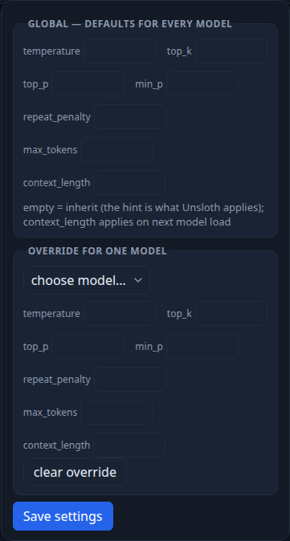
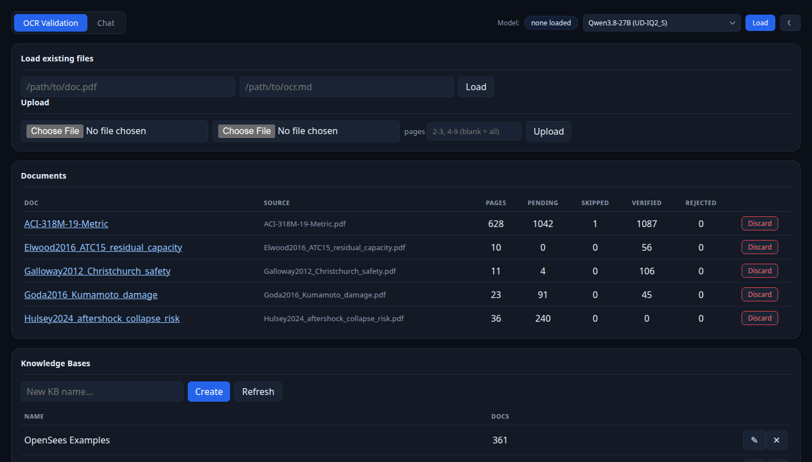

# Verified OCR pipeline

Local OCR-validation + chat toolkit for structural/seismic engineering
research (Kresna's MEXT / SSI-lateral research).

**Source PDF → GLM-OCR → human review → verified data → RAG knowledge base →
ask questions.**

A single Flask server on `:5000` serves everything — two browser-style tabs:

- **OCR Validation** — upload/load a PDF, OCR it with GLM-OCR, review
  item-by-item (tables, equations, figures, text), accept / edit / reject /
  skip, and export verified JSON. Draw a box on the page to OCR just that
  region — with a draw-box type selector: auto, equation (bare LaTeX),
  table, text, or figure (diagram description + optional caption box, like
  tables). Text and inline-math text are one **text** category throughout
  the review UI (the inline-math flag still rides on the data). "OCR more"
  accepts ranges — `5-15` or `20, 30` (which means the *range* 20–30,
  hyphen or pasted en/em dash both fine). Uploading verified items to a
  knowledge base asks before overwriting a same-named document.
- **Chat** — multi-turn sessions against a knowledge base (hybrid RAG,
  top_k=3, per-session KB selector + 4 ACI beam calculation tools
  (shear/flexure/design; the `design_beam` size tool defaults to USD unit
  rates and takes a `preset="idr"` for Indonesian-market prices). Answers
  and
  messages render **markdown** (tables, bold, headers, lists) **and LaTeX**;
  every reply is tagged with the KB it used (`via KB: <name>` / `no KB`).
  Developer mode is a view toggle: every reply's retrieval / reasoning /
  tool-call trace is persisted with the message and shows as a collapsible
  trace under ANY message (past or new) while the toggle is on. A
  🧠 toggle in the top bar sets the thinking mode per session — auto
  (per-question, default) / on / off — so you can compare reasoned vs
  fast-path answers on the same questions (a thinking pass that runs dry
  falls back to a direct answer, so no turn is left empty). The chat
  page is chat-first: the thread fills the viewport with the input pinned at
  the bottom, the Sessions sidebar collapses via the ☰ button (state persists),
  and ⚙ Settings is a dropdown anchored to the button, where every field
  shows what Unsloth itself would apply when left empty — `(unsloth's
  default: …)` hints fetched live from the backend's own OpenAPI (e.g.
  temperature 0.6, top_k 20, max_tokens "until EOS"), so "follow
  Unsloth's default" is visible, not implied. Model-written math
  parameter names are normalized on render (`cover` → `p`;
  `clear_cover` / `stirrup_diameter` / `longitudinal_bar_diameter` → spaced
  words), so equations read as clean notation instead of raw
  `\text{…\_…}` markup. With **no KB selected** the assistant answers from
  general engineering knowledge; with a KB it cites the retrieved chunks
  when the answer draws on them, and if the KB doesn't cover the question
  it answers from general knowledge while saying clearly the answer is not
  from the attached sources (never fakes a citation).

Both pages share a top bar with the **model control**: a chip showing which
model is loaded plus a dropdown of the GGUF models/quants actually cached on
disk — **one entry per installed quant** (e.g. `granite-4.2-8b (Q6_K)`,
`GLM-OCR (Q8_0)`) — and a Load button. The backend holds one resident model
at a time, so a swap is always unload-before-load with a progress toast. The
two defaults are GLM-OCR for OCR and granite (pinned to the `Q6_K`
quant) for chat; any cached model/quant can be picked. The top bar also
carries the **theme toggle** (☾/☀): a deep slate theme with layered surfaces,
soft shadows and styled buttons/inputs/selects is the default, a matching
light theme is one click away, and the choice persists in `localStorage`
(the OCR page's PDF preview stays white on purpose).

Knowledge bases (Unsloth RAG) can be listed / created / renamed / deleted and
fed verified items from the OCR tab (one doc or all). If a document with the
same name is already in the KB, the upload asks first — confirm to overwrite
(the old document is deleted, then re-uploaded).

## Screenshots

Dark theme is the default throughout.

**OCR review** — the ACI 318M-19 metric code, page 92: the PDF preview sits
next to the item cards (a verified table item is scrolled into view):



**Equation review** — GLM-OCR output re-rendered as real math, with the
cross-reference key `(7.6.2.3)` captured from the source page:



**Table editor** — a merged-cell table (Table 22.5.6.2) with the
Merge/Split/Add row/Add column toolbar:



**Chat with tool calls** — a multi-turn session against a knowledge base;
every assistant reply is tagged with the KB it used and carries a
expandable developer trace (retrieval / reasoning / tool calls):



**⚙ Settings** — generation settings with the backend's own defaults shown
inline (`(unsloth's default: …)`), so "follow Unsloth's default" is visible
rather than implied:



**Home / model control** — the shared top bar (loaded-model chip + per-quant
model dropdown + theme toggle), the document list, and the Knowledge Bases
card:



## Requirements

- WSL2 / Linux, Python 3, a GPU (RTX 2080 Ti 11GB works)
- [Unsloth Studio](https://github.com/unslothai/unsloth) running on `:8888`
  (serves the GGUF models + RAG)
- `UNSLOTH_API_KEY` in `.env.local` (see below)
- The models you want to use available to Unsloth (installed via the Unsloth
  UI; defaults that the app wires up: `ggml-org/GLM-OCR-GGUF` for OCR,
  `ibm-granite/granite-4.2-8b-GGUF` pinned to the **`Q6_K`** quant
  (`config.CHAT_GGUF_VARIANT`) for chat — the quant is passed as the load
  endpoint's `gguf_variant` field (a `:Q6_K` suffix inside `model_path` is
  rejected as a literal repo id); the dropdown lists
  whatever is actually cached on disk, one entry per quant)

```bash
pip install -r requirements-ocr.txt
cp .env.local.example .env.local   # set UNSLOTH_API_KEY
```

## Run

Two services, two separate commands each (kill + start in one line kills the
shell — `pkill -f` matches its own command line):

```bash
# 1) Unsloth Studio (:8888)
pkill -f "unsloth[_]studio" || true                      # stop
nohup unsloth studio > /tmp/unsloth-studio.log 2>&1 &    # start (wait ~10s)

# 2) The app (:5000)
pkill -f "python3 app\.py" || true                       # stop
cd ~/Projects/seismic-ai-tools && set -a; . ./.env.local; set +a; \
  nohup python3 app.py > /tmp/seismic-app.log 2>&1 &     # start

# verify
curl -s -o /dev/null -w "%{http_code}\n" http://127.0.0.1:8888/   # 200
curl -s -o /dev/null -w "%{http_code}\n" http://127.0.0.1:5000/   # 200
```

## Share the demo (public link — read the warning)

> **⚠ Security: a quick tunnel is PUBLIC and UNAUTHENTICATED.** Anyone with
> the URL can use your GPU and query your knowledge bases. Treat it as a
> one-off demo link: bring it up right before showtime, share `/chat` (the
> chat page), and kill it the moment the demo is over. Never leave one
> parked unattended, and never put the URL in a public chat.

```bash
# bring up (grab the https://...trycloudflare.com URL from the log)
nohup cloudflared tunnel --url http://127.0.0.1:5000 \
  > /tmp/cloudflared.log 2>&1 &
grep -oP 'https://[a-z0-9-]+\.trycloudflare\.com' /tmp/cloudflared.log | tail -1

# take down (verify with pgrep -x; bare 'pkill cloudflared' matches itself)
pkill -f "cloudflared tunnel --url" || true
pgrep -x cloudflared || echo "tunnel down"
```

Share `https://<url>/chat` so she lands directly on the chat tab (sessions
are per-browser and auto-created on first send).

Open <http://127.0.0.1:5000>.

## Tests

```bash
python3 test_itemizer.py                 # 76 itemizer assertions
python3 functions/test_shear_tools.py    # 28 beam tool checks
python3 orchestrator.py --selftest       # chat loop trace checks (offline)
python3 rag_uploader.py --selftest       # KB render checks (offline)
python3 models.py --selftest             # model mgmt wiring (offline)
python3 smoke_test.py                    # 270 end-to-end route checks (no
                                              # live OCR)
```

## Layout

- `app.py` — the Flask server (OCR review + chat sessions + KB routes + model dropdown)
- `ocr_engine.py` / `itemizer.py` — GLM-OCR client, markdown → review items
- `rag_uploader.py` — verified JSON → Unsloth RAG KB (render + upload)
- `orchestrator.py` — RAG + tool-calling chat engine (CLI + importable by app)
- `models.py` — Unsloth model list (cached disk, per-quant) / load / unload / status
- `functions/` — ACI 318M-19 beam shear/flexure/design tools (`beam_calc.py`,
  schema-driven `wrapper.py`; `design_beam` sizes the cheapest beam for
  given Vu/Mu + section bounds, min total cost per metre at USD-default
  placeholder rates or the `idr` preset (Indonesian Rp/m³, Rp/kg))
- `schemas/` — OpenAI function-calling tool schemas
- `templates/` — `_header.html` (tabs + per-quant model dropdown + theme
  toggle + shared CSS tokens), `index.html` (OCR),
  `chat.html` (chat: markdown + LaTeX rendering, KB tag, dev trace,
  full-height layout / collapsible sidebar / settings dropdown)
- `docs/` — infrastructure, KB query guidance, corrections, voice roadmap
- `validation/` — pending docs, verified/rejected item JSON (gitignored)
- `sessions/` — chat sessions (gitignored)

## More

- `AGENTS.md` — detailed, always-synced technical reference for AI assistants
  (and anyone digging into the internals)
- `docs/rag-query-guidance.md` — how to query the KB for table/formula questions
- `docs/voice-roadmap.md` — planned voice / AIRI integration (docs only, not
  implemented)
